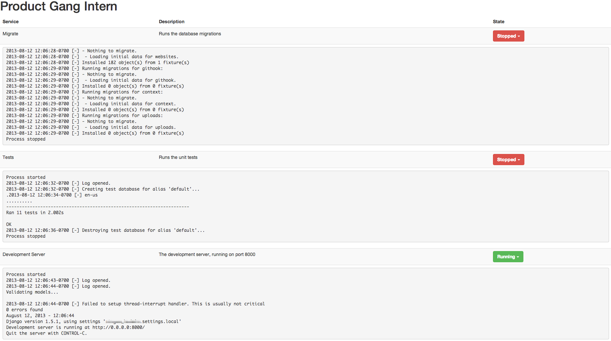

intern
======

Making development with vagrant so easy that even your intern can use it.

We built Intern so that interns or other externals can kickstart development.
Basically it's a Flask server for the frontend (Bootstrap 3) and a Twisted/
Autobahn server for running the websockets and executing/managing the
processes.

Installation
------------

Clone the repo, edit the `config.json` to fit your needs.

Add the intern folder to your vagrant config:

    config.vm.synced_folder "./intern/", "/home/vagrant/intern"

And forward ports 5000 (http) and  9000 (websockets):

    config.vm.network :forwarded_port, guest: 5000, host: 5000
    config.vm.network :forwarded_port, guest: 9000, host: 9000

Also you need a virtualenv, in which you have to install the requirements.txt.
You could e.g. use the python cookbook:

    python_virtualenv "/home/vagrant/env_intern" do
      interpreter "python2.7"
      owner "vagrant"
      group "vagrant"
      action :create
    end

Running it
----------

You can use the following command to start the intern server, though we
recommend you put the command into a shellfile in the same level as the
Vagrantfile, so that your interns only have to run `vagrant up; ./intern.sh`.
You can also add cool stuff like `open http://localhost:5000` into this
shellfile to make it even easier.

    vagrant ssh -c 'source env_intern/bin/activate; cd intern; python intern.py'

Example configuration
---------------------

An example configuration could look like this:

    {
        "title": "Product Gang Intern",
        "services": {
            "devserver": {
                "name": "Development Server",
                "description": "The development server, running on port 8000",
                "command": "/home/vagrant/env_project/bin/python",
                "args": ["manage.py", "runserver", "0.0.0.0:8000", "--settings", "project.settings.local"],
                "path": "/home/vagrant/project/"
            },
            "migrate": {
                "name": "Migrate",
                "description": "Runs the database migrations",
                "command": "/home/vagrant/env_project/bin/python",
                "args": ["manage.py", "migrate", "--settings", "project.settings.local"],
                "path": "/home/vagrant/project/"
            },
            "tests": {
                "name": "Tests",
                "description": "Runs the unit tests",
                "command": "/home/vagrant/env_project/bin/python",
                "args": ["manage.py", "test", "--settings", "project.settings.test"],
                "path": "/home/vagrant/project/"
            }
        }
    }